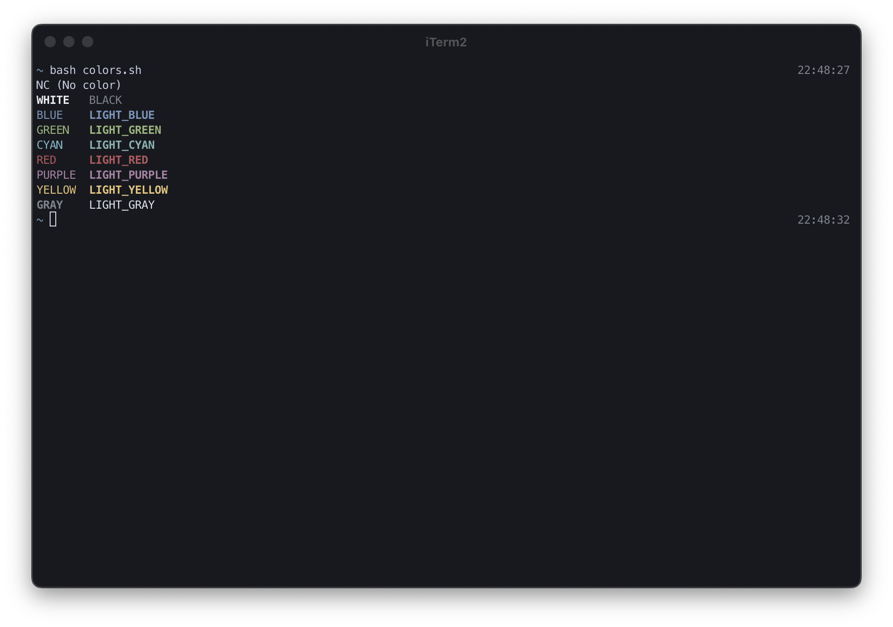

# iTerm2 - Nord Dark

A darker version of [Nord](https://www.nordtheme.com/) theme for iTerm2.

## Install

- Right-click [`Nord Dark.itermcolors`](https://raw.githubusercontent.com/rbika/iterm2-nord-dark/master/Nord%20Dark.itermcolors) and choose `Save Link As…`.
- Double-click the downloaded file.

## Color Reference

| Text     | Foreground | Background |
| -------- | :--------: | :--------: |
| Default  | `#d0d5e5`  | `#1e232b`  |
| Selected | `#d8dde8`  | `#4c5569`  |

| Color   |  Normal   |  Bright   |
| ------- | :-------: | :-------: |
| Black   | `#8c8f99` | `#8c8f99` |
| Red     | `#be6069` | `#be6069` |
| Green   | `#a3bd8b` | `#a3bd8b` |
| Yellow  | `#ebca8a` | `#ebca8a` |
| Blue    | `#81a0c0` | `#81a0c0` |
| Magenta | `#b48dac` | `#b48dac` |
| Cyan    | `#88bfcf` | `#88bfcf` |
| White   | `#e5e8ef` | `#e5e8ef` |
